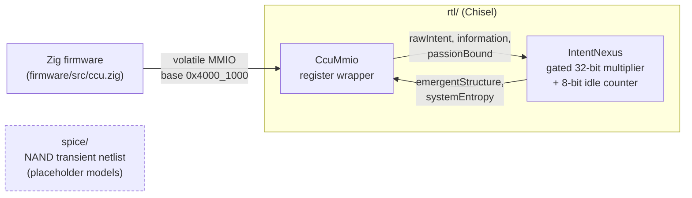
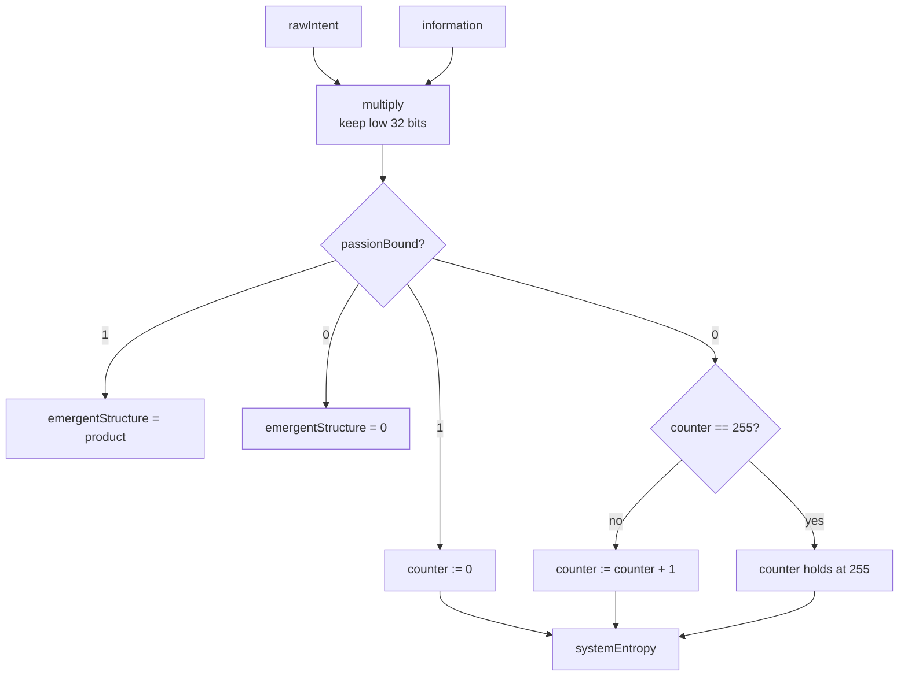
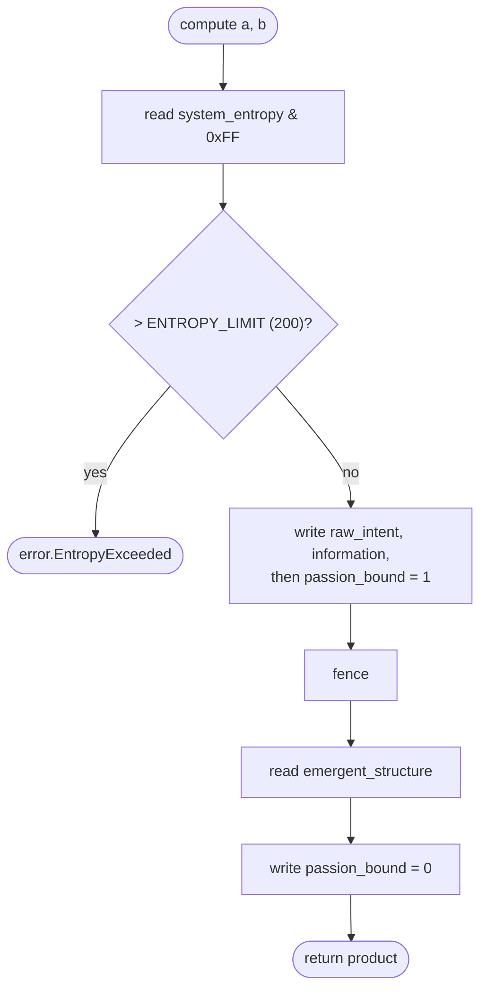
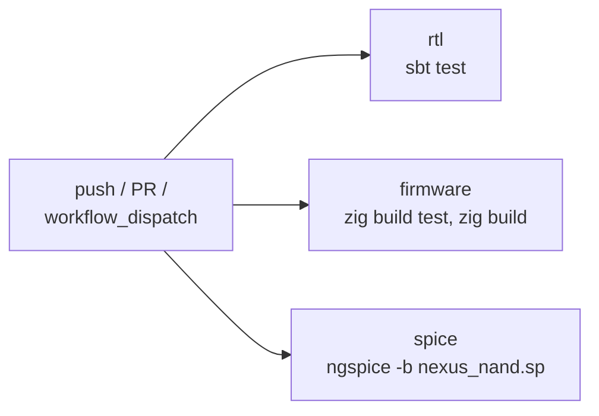

# INTENT-V

[](https://github.com/BEL-ESPRIT-D-ACCORD-TRUST-HOLDINGS/demo-repository/actions/workflows/ci.yml)
[](LICENSE)


A small RV32IM-adjacent hardware/firmware sandbox: a memory-mapped accelerator,
its bare-metal driver, and an analog sanity netlist.

**What the "Conscious Coherence Unit" actually is:** a gated 32-bit multiplier
(`rawIntent * information`, low 32 bits, output enabled by `passionBound`) plus
an 8-bit saturating counter of cycles since it was last enabled. The thematic
signal names are aliases for that; nothing here exhibits anything beyond
multiplication and a mux. Please don't describe it to anyone as more.

| Dir         | Contents                                              | Toolchain        |
|-------------|-------------------------------------------------------|------------------|
| `rtl/`      | `IntentNexus` core, `CcuMmio` register wrapper, tests | sbt, Chisel 3.6  |
| `firmware/` | Zig 0.13 bare-metal driver, linker script             | zig              |
| `spice/`    | NAND-gate transient netlist + placeholder models      | ngspice          |

## Register map (base `0x4000_1000`)

| Offset | Name               | Access |
|--------|--------------------|--------|
| 0x00   | raw_intent         | RW     |
| 0x04   | information        | RW     |
| 0x08   | passion_bound[0]   | RW     |
| 0x0C   | emergent_structure | RO     |
| 0x10   | system_entropy[7:0]| RO     |

See [VERIFY.md](VERIFY.md) for the verification checklist.

## Architecture



## Inside `IntentNexus`



## Driver flow (`Ccu.compute`)



## CI pipeline



## Commands

```sh
cd rtl      && sbt test            # unit tests; `sbt run` emits Verilog to rtl/generated
cd firmware && zig build test      # host-side driver tests
cd firmware && zig build           # RV32IM ELF
cd spice    && ngspice -b nexus_nand.sp
```

## Status

Written without the toolchains available, so **none of the above has been
run yet**. CI (`.github/workflows/ci.yml`) is the first real check.
The SPICE netlist uses placeholder level-1 models; its timing numbers say
nothing about a real 32nm process.

## License

Licensed under the [Apache License 2.0](LICENSE).
